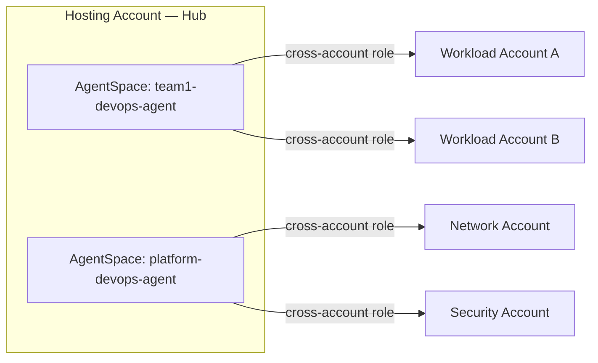

<!-- markdownlint-disable -->
<a href="https://www.appvia.io/"></a><br/><p align="right"> <a href="https://registry.terraform.io/modules/appvia/terraform-aws-devops-agent/aws"></a></a> <a href="https://github.com/appvia/devops-agent/aws"></a> <a href="https://appvia-community.slack.com/join/shared_invite/zt-1s7i7xy85-T155drryqU56emm09ojMVA#/shared-invite/email"></a> <a href="https://github.com/appvia/terraform-aws-devops-agent/graphs/contributors"></a>

<!-- markdownlint-restore -->
<!--
  ***** CAUTION: DO NOT EDIT ABOVE THIS LINE ******
-->


# Terraform AWS DevOps Agent

## Description

This module provisions a production-ready AWS DevOps Agent Space with the IAM roles, account associations, and security controls needed to run autonomous SRE investigations across a multi-account AWS estate. It includes:

- **Agent Space Provisioning**: Full Agent Space lifecycle managed via the `awscc` provider
- **IAM Role Management**: AgentSpace and Operator App roles with least-privilege AWS-managed policies
- **Primary Account Hardening**: Explicit deny policy preventing the agent from indexing resources in the hosting account — defence in depth enforced unconditionally via IAM, not tags
- **Multi-Account Associations**: Hub-and-spoke model with one primary (monitor) association and N secondary (source) workload account associations
- **Region Validation**: Input validation enforcing deployment only to regions where the `aidevops` service is available
- **IAM Propagation Safety**: 30-second wait injected before Agent Space creation to avoid race conditions

## Key Features

### 🏢 **One Agent Space Per Team**

Appvia's recommended pattern is **one Agent Space per team or per product**. An Agent Space is the primary security and operational boundary — it controls which accounts the agent can query, who can view investigations, and which integrations are in scope.

| Team | Agent Space | Account Visibility |
|---|---|---|
| Software Dev Team 1 | `team1-devops-agent` | Only the accounts and resources that team owns |
| Software Dev Team 2 | `team2-devops-agent` | Only the accounts and resources that team owns |
| Platform Team | `platform-devops-agent` | All platform accounts — full horizontal view |

This model avoids cross-team data exposure, keeps investigation noise scoped per team, and means each team has independent service quota headroom (concurrent investigations, evaluations). A single AWS account can host multiple Agent Spaces.

### 🔗 **Hub-and-Spoke Multi-Account Architecture**

The module is designed around a dedicated **hosting account (hub)** that owns all Agent Spaces, and one or more **secondary/workload accounts (spokes)** that the agent monitors. This mirrors the recommended AWS deployment model and keeps the hosting infrastructure cleanly separated from the workloads being investigated.



**IAM layout per Agent Space:**

| Account | Role | Policy | Purpose |
|---|---|---|---|
| Hub | `DevOpsAgentRole-AgentSpace-<prefix>` | `AIDevOpsAgentAccessPolicy` + `DenyPrimaryAccountDiscovery` inline deny | Agent investigation role; explicit deny blocks resource indexing of the hosting account itself |
| Hub | `DevOpsAgentRole-WebappAdmin-<prefix>` | `AIDevOpsOperatorAppAccessPolicy` | Operator web app authentication |
| Each spoke | `DevOpsAgentCrossAccountRole` | `AIDevOpsAgentAccessPolicy` | Agent read access to workload resources; trust scoped to the specific AgentSpace ARN |

The cross-account trust policy in each spoke references the exact `agent_space_arn` output from Phase 1 — a wildcard trust across all Agent Spaces in the hosting account is not used. Use the `modules/spoke` submodule (included in this module) to create this role in each workload account.

**Cross-region monitoring:** The AgentSpace region does not constrain which AWS regions the agent can query. Workload accounts in `eu-west-2` are fully visible from an AgentSpace hosted in `eu-west-1`.

> **Note:** `eu-west-2` (London) is not a supported AgentSpace region. For UK gov, deploy the AgentSpace itself into `eu-west-1` (Ireland) or `eu-central-1` (Frankfurt) — workloads in `eu-west-2` remain fully visible.

### 🔐 **Security — IAM Deny Policies, Not Tag Restrictions**

AWS supports restricting the agent via IAM tag conditions. This module deliberately does not use that approach:

- **Tags are mutable.** Anyone with `ec2:CreateTags` can remove or alter a tag and bring a resource into scope. IAM `Deny` statements cannot be overridden by any other attached policy — they are enforced unconditionally.
- **The hosting account is hard-excluded.** An explicit `DenyPrimaryAccountDiscovery` inline policy denies all `resource-explorer-2:*` and `tag:Get*` actions on the agentspace role, regardless of what `AIDevOpsAgentAccessPolicy` permits. Resource indexing is only intended for secondary workload accounts.
- **Defence in depth.** `AIDevOpsAgentAccessPolicy` is read-only by design (`Describe*`, `Get*`, `List*` across ~150 services — the only write action is `support:CreateCase`). The inline deny is a second, independent enforcement layer.

### 🌍 **EU / UK Government Data Residency**

At GA (March 2026), AWS confirmed EU-hosted Agent Spaces process inference within the EU — requests do not route through US infrastructure. For UK gov and EU workloads, deploy the AgentSpace into `eu-west-1` (Ireland) or `eu-central-1` (Frankfurt). Workload accounts in `eu-west-2` (London) are fully visible from either region — cross-region monitoring is supported regardless of where the AgentSpace is hosted.

### 🤖 **Read-Only by Design**

The agent is a read-and-report system. It cannot start/stop instances, execute shell commands, read S3 object content, read Secrets Manager values, invoke Lambda, or modify any IAM resource. The only outbound writes are `support:CreateCase` and posting findings to connected third-party tools (PagerDuty, ServiceNow, Slack).

## Usage

### Basic — Single Hosting Account, No Workloads (Phase 1)

On first apply, leave `secondary_accounts` empty. This creates the Agent Space and emits `agent_space_arn` as an output, which you need before configuring cross-account trust policies in secondary workload accounts.

```hcl
module "devops_agent" {
  source = "appvia/devops-agent/aws"
  version = "0.1.0"

  agent_space_name        = "Platform Team"
  agent_space_description = "DevOps Agent Space for the Platform Engineering team"
  agentspace_region       = "eu-west-1"
  name_prefix             = "platform"

  tags = {
    Team        = "platform"
    Environment = "prod"
    ManagedBy   = "terraform"
  }
}

output "agent_space_arn" {
  value = module.devops_agent.agent_space_arn
}
```

### With Workload Account Associations (Phase 2)

After Phase 1, use the `modules/spoke` submodule to create the cross-account IAM role in each workload account. Each spoke is called with a provider alias pointing at that account. The `agent_space_arn` from Phase 1 is passed in directly — the spoke module extracts the hosting account ID from it automatically.

```hcl
# Configure provider aliases — one per account
provider "aws" {
  alias = "hosting"
  # assume_role or profile for the hosting account
}

provider "aws" {
  alias = "dev"
  # assume_role or profile for the dev workload account
}

provider "aws" {
  alias = "payments"
  # assume_role or profile for the payments workload account
}

# Phase 2a — deploy spoke roles into each workload account
module "spoke_dev" {
  source  = "appvia/devops-agent/aws//modules/spoke"
  version = "0.1.0"
  providers = { aws = aws.dev }

  agent_space_arn = "arn:aws:aidevops:eu-west-1:HOSTING_ACCOUNT_ID:agentspace/AGENT_SPACE_ID"
}

module "spoke_payments" {
  source  = "appvia/devops-agent/aws//modules/spoke"
  version = "0.1.0"
  providers = { aws = aws.payments }

  agent_space_arn = "arn:aws:aidevops:eu-west-1:HOSTING_ACCOUNT_ID:agentspace/AGENT_SPACE_ID"
}

# Phase 2b — re-apply the hub with secondary_accounts populated from spoke outputs
module "devops_agent" {
  source  = "appvia/devops-agent/aws"
  version = "0.1.0"
  providers = {
    aws   = aws.hosting
    awscc = awscc.hosting
  }

  agent_space_name        = "Platform Team"
  agent_space_description = "DevOps Agent Space for the Platform Engineering team"
  agentspace_region       = "eu-west-1"
  name_prefix             = "platform"

  secondary_accounts = {
    dev = {
      account_id             = "111122223333"
      cross_account_role_arn = module.spoke_dev.role_arn
    }
    payments = {
      account_id             = "444455556666"
      cross_account_role_arn = module.spoke_payments.role_arn
    }
  }

  tags = {
    Team        = "platform"
    Environment = "prod"
    ManagedBy   = "terraform"
  }
}
```

> **Two-phase apply is required.** The spoke trust policy must reference the real `agent_space_arn`, which only exists after Phase 1 completes. Hardcode the ARN from the Phase 1 output into each spoke module call, then apply Phase 2 — Terraform will create the spoke roles first (they have no dependency on the hub in Phase 2) and then update the hub associations.

### Per-Team Pattern (Multiple Agent Spaces in One Account)

```hcl
module "devops_agent_team1" {
  source  = "appvia/devops-agent/aws"
  version = "0.1.0"

  agent_space_name  = "Software Dev Team 1"
  agentspace_region = "eu-west-1"
  name_prefix       = "team1"

  secondary_accounts = {
    team1-dev  = { account_id = "111122223333", cross_account_role_arn = "arn:aws:iam::111122223333:role/DevOpsAgentCrossAccountRole" }
    team1-prod = { account_id = "444455556666", cross_account_role_arn = "arn:aws:iam::444455556666:role/DevOpsAgentCrossAccountRole" }
  }

  tags = { Team = "team1", ManagedBy = "terraform" }
}

module "devops_agent_platform" {
  source  = "appvia/devops-agent/aws"
  version = "0.1.0"

  agent_space_name  = "Platform Team"
  agentspace_region = "eu-west-1"
  name_prefix       = "platform"

  secondary_accounts = {
    network  = { account_id = "777788889999", cross_account_role_arn = "arn:aws:iam::777788889999:role/DevOpsAgentCrossAccountRole" }
    security = { account_id = "000011112222", cross_account_role_arn = "arn:aws:iam::000011112222:role/DevOpsAgentCrossAccountRole" }
    dev  = { account_id = "111122223333", cross_account_role_arn = "arn:aws:iam::111122223333:role/DevOpsAgentCrossAccountRole" }
    prod = { account_id = "444455556666", cross_account_role_arn = "arn:aws:iam::444455556666:role/DevOpsAgentCrossAccountRole" }
  }

  tags = { Team = "platform", ManagedBy = "terraform" }
}
```

## Supported Regions

The `agentspace_region` variable is validated against the regions where the `aidevops` service is available:

| Region | Location |
|---|---|
| `us-east-1` | US East (N. Virginia) |
| `us-west-2` | US West (Oregon) |
| `eu-west-1` | Europe (Ireland) |
| `eu-central-1` | Europe (Frankfurt) |
| `ap-southeast-2` | Asia Pacific (Sydney) |
| `ap-northeast-1` | Asia Pacific (Tokyo) |

> **Note:** `eu-west-2` (London) is not a supported AgentSpace region. For UK gov data residency, deploy into `eu-west-1` (Ireland) or `eu-central-1` (Frankfurt).

## Examples

See the [examples](examples/) directory for complete usage examples:

- [Hosting Account — AgentSpace Deployment](examples/hosting-account/) — Phase 1: create AgentSpace
- [Spoke — Basic Cross-Account Role](examples/spoke/spoke-workload-basic/) — minimal workload account setup
- [Spoke — ECS/Fargate with Permissions Boundary](examples/spoke/spoke-workload-ecs/)
- [Spoke — EKS with Permissions Boundary](examples/spoke/spoke-workload-eks/)

## Requirements

| Name | Version |
|------|---------|
| <a name="requirement_terraform"></a> [terraform](#requirement\_terraform) | >= 1.14.9 |
| <a name="requirement_aws"></a> [aws](#requirement\_aws) | >= 6.0.0 |
| <a name="requirement_awscc"></a> [awscc](#requirement\_awscc) | ~> 1.0 |
| <a name="requirement_time"></a> [time](#requirement\_time) | ~> 0.9 |

## Providers

| Name | Version |
|------|---------|
| <a name="provider_aws"></a> [aws](#provider\_aws) | >= 6.0.0 |
| <a name="provider_awscc"></a> [awscc](#provider\_awscc) | ~> 1.0 |
| <a name="provider_time"></a> [time](#provider\_time) | ~> 0.9 |

## Update Documentation

The `terraform-docs` utility is used to generate this README. Follow the below steps to update:

1. Make changes to the `.terraform-docs.yml` file
2. Fetch the `terraform-docs` binary (https://terraform-docs.io/user-guide/installation/)
3. Run `terraform-docs markdown table --output-file ${PWD}/README.md --output-mode inject .`

<!-- BEGIN_TF_DOCS -->
## Inputs

| Name | Description | Type | Default | Required |
|------|-------------|------|---------|:--------:|
| <a name="input_agent_space_name"></a> [agent\_space\_name](#input\_agent\_space\_name) | Display name of the DevOps Agent Space (shown in the console — spaces allowed) | `string` | n/a | yes |
| <a name="input_agentspace_region"></a> [agentspace\_region](#input\_agentspace\_region) | AWS region where the Agent Space is deployed. Supported regions: us-east-1, us-west-2, eu-west-1, eu-central-1, ap-southeast-2, ap-northeast-1. eu-west-2 (London) is not supported. | `string` | n/a | yes |
| <a name="input_agent_space_description"></a> [agent\_space\_description](#input\_agent\_space\_description) | Description for the DevOps Agent Space | `string` | `"AWS DevOps Agent Space"` | no |
| <a name="input_name_prefix"></a> [name\_prefix](#input\_name\_prefix) | Short slug used in IAM role names — no spaces or special chars. Defaults to agent\_space\_name with spaces replaced by hyphens if not set. | `string` | `""` | no |
| <a name="input_secondary_accounts"></a> [secondary\_accounts](#input\_secondary\_accounts) | Map of workload accounts to associate as secondary sources. Key is a short label used in resource names. Leave empty on first apply; populate after capturing agent\_space\_arn. | <pre>map(object({<br/>  account_id             = string<br/>  cross_account_role_arn = string<br/>}))</pre> | `{}` | no |
| <a name="input_tags"></a> [tags](#input\_tags) | Tags to apply to all resources | `map(string)` | `{}` | no |

## Outputs

| Name | Description |
|------|-------------|
| <a name="output_agent_space_id"></a> [agent\_space\_id](#output\_agent\_space\_id) | ID of the DevOps Agent Space |
| <a name="output_agent_space_arn"></a> [agent\_space\_arn](#output\_agent\_space\_arn) | ARN of the DevOps Agent Space — use this to scope the workload cross-account role trust policy |
| <a name="output_agent_space_name"></a> [agent\_space\_name](#output\_agent\_space\_name) | Name of the DevOps Agent Space |
| <a name="output_agentspace_role_arn"></a> [agentspace\_role\_arn](#output\_agentspace\_role\_arn) | ARN of the DevOps AgentSpace IAM role (assumed by the agent for resource indexing) |
| <a name="output_operator_role_arn"></a> [operator\_role\_arn](#output\_operator\_role\_arn) | ARN of the DevOps Operator App IAM role (assumed by the agent to drive the web app) |
<!-- END_TF_DOCS -->
